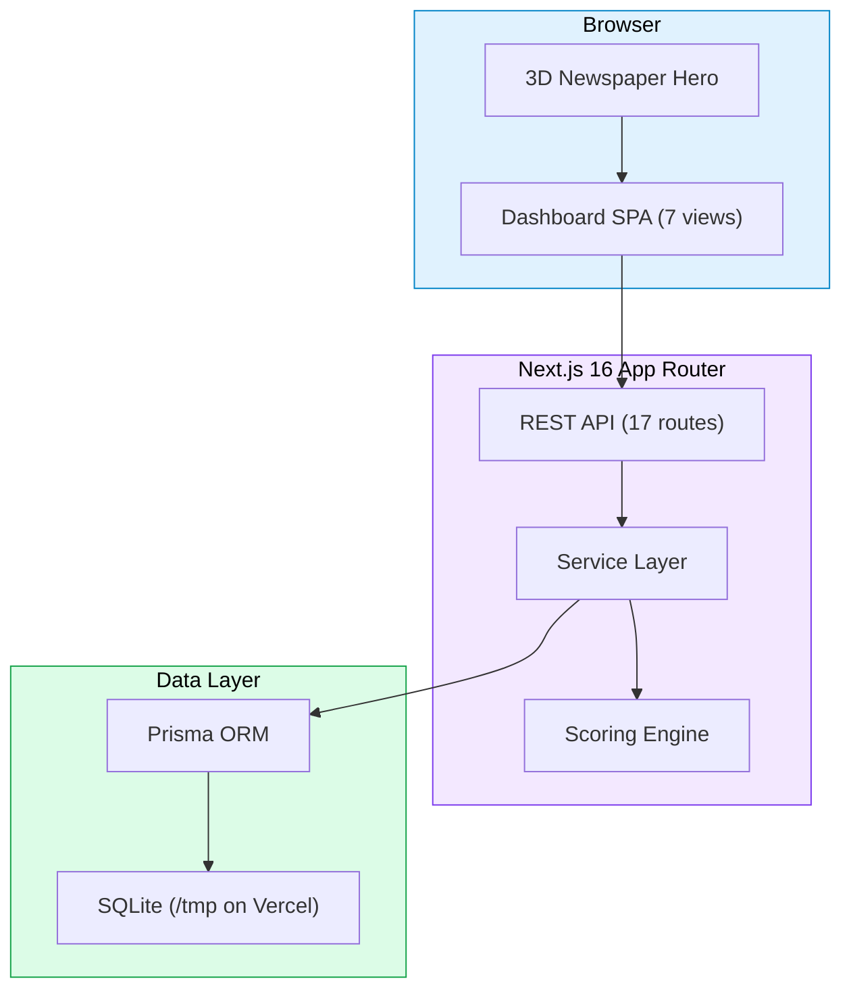
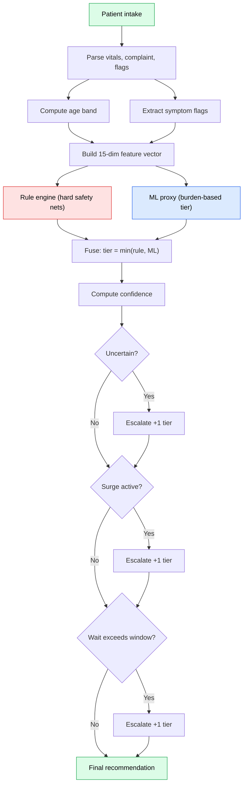
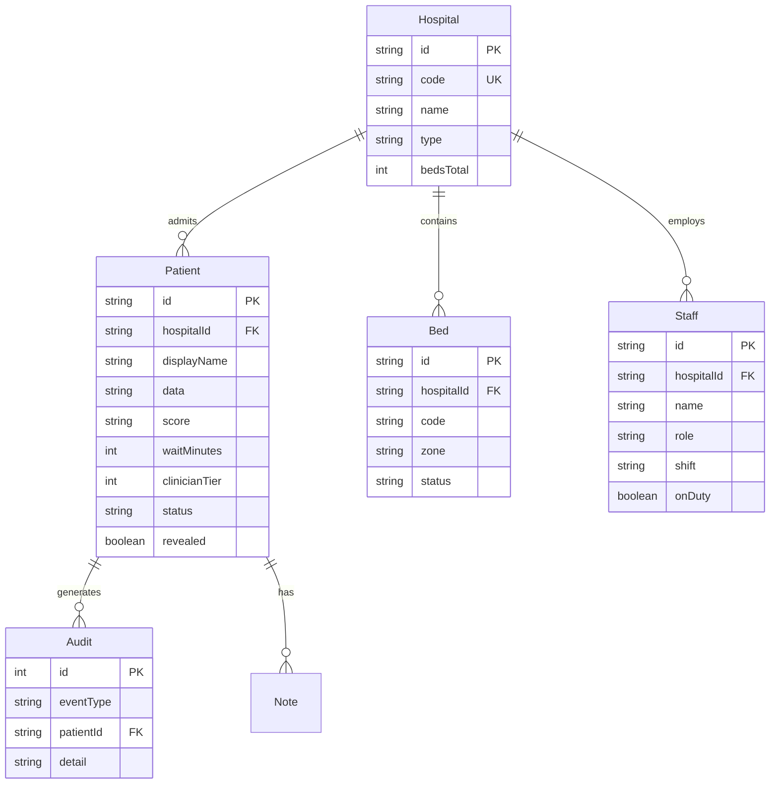

# TriageSetu

Safety-first AI triage for emergency care. A hybrid rule and ML scoring engine that helps emergency department staff prioritize and route patients, with explicit uncertainty, clinician override, and an append-only audit trail.

Built for the PatientTriage.ai track of the Accenture Innovation Challenge, Round 2.

> This is a clinical workflow prototype, not a diagnostic device or medical advice. The scoring engine runs entirely in-process. No external model API calls are made.

---

## Implementation Approach

The prototype addresses seven real-world complexities from the PatientTriage.ai brief.

### Age-aware normalization

Vital sign thresholds differ across pediatric (under 18), adult (18 to 64), and geriatric (65 and over) populations. A fever of 38.5 degrees C carries different urgency in a 3-year-old versus a 75-year-old. The engine age-bands every vital before scoring.

### Hybrid rule and ML scoring

Rather than trusting a single black-box model, TriageSetu runs two scorers in parallel:

- A transparent rule engine with hard safety nets for AVPU, active bleeding, SpO2 floors, chest symptoms, and age-specific thresholds.
- An ML proxy calibrated to mirror a trained HistGradientBoostingClassifier's burden formula, ported one-to-one from the original Python prototype to TypeScript.

The two tiers are fused with `Math.min(ruleTier, mlTier)`. The more conservative tier always wins.

### Explicit uncertainty fusion

Confidence is not just model probability. It is a composite of margin (distance from threshold boundary), completeness (how many vitals are recorded), agreement (do rule and ML agree), and history availability (does the patient have prior records).

When confidence is low, the rule and ML disagree, or history is missing, the system escalates one tier and flags it for clinician review.

### Asymmetric costs of triage error

Under-triage (missing a critical case) is categorically worse than over-triage (over-prioritizing a minor one). The escalation policy reflects this. Uncertainty always pushes toward higher acuity, never lower.

### Surge protocol

During mass-casualty events or 3x patient volume, clinicians can toggle surge mode. Borderline cases (confidence below 82 or ML tier 3 or below) automatically escalate one level. The entire queue is rescored against the new policy on toggle.

### Deterioration reassessment

Patients waiting beyond their tier's safety window are auto-escalated.

| Tier | Safety window |
|------|---------------|
| ESI 1 to 2 (Resuscitation / Emergent) | 15 minutes |
| ESI 3 (Urgent) | 30 minutes |
| ESI 4 to 5 (Less / Non-urgent) | 90 minutes |

The Advance clock feature simulates time passing. Every patient is rescored against the new wait time.

### Clinical accountability and DPDP compliance

Every recommendation, override, surge toggle, and time advance is written to an append-only audit ledger with timestamp, clinician ID, role, and rationale. Patient data is pseudonymous by default. Bulk exports redact raw complaints unless break-glass was exercised. The Settings page supports DPDP (India), HIPAA (US), GDPR (EU), and PDPA (Singapore) jurisdictions.

---

## Solution Architecture

### High-level architecture



The application is a single-page Next.js app. On first load, users see a 3D newspaper-style hero landing page. Clicking Enter dashboard transitions to the main workspace, which contains seven views: Live Queue, New Intake, Analytics, Bed Board, Staff Roster, Audit Trail, and Settings.

All 17 REST endpoints live under `/api/` and are implemented as Next.js Route Handlers. Each endpoint that reads data calls `ensureSeed()` first, which idempotently creates the schema and seeds 20 demo patients, 2 hospitals, 65 beds, and 16 staff if the database is empty.

### Scoring pipeline



The scoring engine is a faithful TypeScript port of the original Python prototype. It runs synchronously in the Route Handler with no external model API calls. Rules can only escalate, never downgrade.

### Data model



---

## Dependencies

### Production stack

| Layer | Technology | Version |
|-------|-----------|---------|
| Framework | Next.js (App Router) | 16.1 |
| Language | TypeScript | 5 |
| Styling | Tailwind CSS | 4 |
| UI components | shadcn/ui (New York) | latest |
| ORM | Prisma | 6.11 |
| Database | SQLite | bundled |
| Animations | Framer Motion | 12.23 |
| Charts | Recharts | 2.15 |
| State | Zustand | 5.0 |
| Theming | next-themes | 0.4 |
| Toasts | sonner | 2.0 |
| Validation | Zod | 4.0 |
| Icons | lucide-react | 0.525 |

### Newspaper fonts (loaded via next/font/google)

| Font | Role |
|------|------|
| UnifrakturMaguntia | Blackletter masthead |
| Playfair Display | Didone headlines and stat numbers |
| Lora | Old Style serif body text |
| Geist + Geist Mono | UI sans-serif and monospace |

### Seeded demo data

| Entity | Count | Notes |
|--------|-------|-------|
| Hospitals | 2 | District Hospital Mumbai ED (48 beds), Rural Health Centre Pune (22 beds) |
| Patients | 20 | Pediatric, geriatric, ambiguous, zero-history, unconscious, pregnant, stroke, chest pain, asthma |
| Beds | 65 | Across 5 zones: Resus, Major, Minor, Observation, Paediatric |
| Staff | 16 | Across day, evening, and night shifts |
| Audit entries | 1 | Initial SYSTEM seed event (grows with usage) |

---

## Execution Instructions

### Prerequisites

- Node.js 20 or higher
- Bun 1.0 or higher (recommended), or npm / pnpm as alternatives

### Local development

```bash
# Clone the repository
git clone https://github.com/HarshvardhanJ/triagesetu.git
cd triagesetu

# Install dependencies
bun install

# Push the Prisma schema (creates db/custom.db if missing)
bun run db:push

# Start the dev server
bun run dev
```

Open http://localhost:3000. You will land on the 3D newspaper hero page. Click Open dashboard to enter the workspace.

The app auto-seeds 20 demo patients, 2 hospitals, 65 beds, and 16 staff on first API call if the database is empty. No manual seed step is needed.

### Available scripts

| Command | Description |
|---------|-------------|
| `bun run dev` | Start dev server on port 3000 |
| `bun run build` | Production build |
| `bun run start` | Start production server |
| `bun run lint` | Run ESLint |
| `bun run db:push` | Push schema to SQLite |
| `bun run db:generate` | Regenerate Prisma client |
| `bun run db:reset` | Reset database (re-seeds on next load) |

### Reset to baseline

```bash
# Via API
curl -X POST http://localhost:3000/api/demo/reset

# Or via UI: Settings, then Reset to demo baseline
```

---

## Deployment

### Push to GitHub

```bash
git init
git add .
git commit -m "Initial commit: TriageSetu"
git branch -M main
git remote add origin https://github.com/<your-username>/triagesetu.git
git push -u origin main
```

### Deploy on Vercel

1. Go to vercel.com/new and import your GitHub repo.
2. Framework preset is auto-detected as Next.js.
3. Build command: `bun run build`.
4. Install command: `bun install`.
5. No environment variables are required for the demo. The app auto-detects Vercel and writes SQLite to `/tmp`, which is the only writable location on Vercel's serverless filesystem.
6. Deploy.

### Note on SQLite and Vercel

Vercel's serverless functions have an ephemeral filesystem. The app handles this by redirecting the SQLite file to `/tmp/triagesetu.db` when `process.env.VERCEL` is set. The database is re-seeded on every cold start, so data persists for the lifetime of a single container (typically minutes) and resets on the next cold start.

For true persistence across cold starts, swap to a managed Postgres. Change `provider = "postgresql"` in `prisma/schema.prisma` and set `DATABASE_URL` to your Postgres connection string. Neon, Supabase, and PlanetScale all offer free tiers that work with this schema.

---

## Safety and Compliance

| Guarantee | Implementation |
|-----------|----------------|
| Rules can only escalate | `tier = Math.min(ruleTier, mlTier)`, never raises the floor |
| Confidence surfaced | Every recommendation ships with a percentage and label |
| Uncertainty triggers escalation | Low confidence, disagreement, or missing history escalates by one tier |
| Surge policy | Toggleable, rescores entire queue on toggle |
| Deterioration monitoring | Wait-time safety windows (15, 30, 90 minutes) auto-escalate |
| Clinician override | Requires rationale, clinician ID, and role. Audit-locked. |
| Pseudonymous by default | Auto-assigned TS-XXX IDs, raw data masked in bulk exports |
| Break-glass | Records access event to audit trail |
| Multi-jurisdiction | DPDP, HIPAA, GDPR, PDPA settings |
| Configurable retention | 30, 90, 180, or 365 days |

---

## Project Structure

```
triagesetu/
├── prisma/
│   └── schema.prisma              # Prisma schema — 7 database models
│
├── public/
│   ├── favicon.svg                # TriageSetu stethoscope favicon
│   └── logo.svg                   # Application logo
│
├── db/
│   └── custom.db                  # Seeded SQLite database
│                                  # 20 patients, 2 hospitals,
│                                  # 65 beds, and 16 staff members
│
├── src/
│   ├── app/
│   │   ├── api/                   # 17 REST API route handlers
│   │   ├── globals.css            # Tailwind CSS, newspaper theme & 3D utilities
│   │   ├── layout.tsx             # Fonts, ThemeProvider & metadata
│   │   └── page.tsx               # Landing page → dashboard switcher
│   │
│   ├── components/
│   │   ├── ui/                    # Reusable shadcn/ui components
│   │   │
│   │   └── triage/                # Core TriageSetu interface
│   │       ├── hero-landing.tsx   # 3D newspaper-style landing page
│   │       ├── sidebar.tsx        # 3D navigation rail
│   │       ├── header.tsx         # Sticky glassmorphism header
│   │       ├── live-queue.tsx     # Live patient queue with 3D tilt cards
│   │       ├── patient-detail.tsx # Patient details & sticky override actions
│   │       ├── intake-form.tsx    # Patient intake with live triage scoring
│   │       ├── audit-trail.tsx    # Gradient-based activity timeline
│   │       ├── analytics.tsx      # Recharts analytics dashboard
│   │       ├── bed-board.tsx      # Hospital bed & zone management
│   │       ├── staff-roster.tsx   # On-duty staff management
│   │       ├── settings-view.tsx  # Compliance settings & system reset
│   │       ├── metric-card.tsx    # Animated 3D statistics cards
│   │       ├── tier-badge.tsx     # Glass-style triage tier badges
│   │       └── confidence-meter.tsx # Triage confidence visualization
│   │
│   └── lib/
│       ├── triage.ts              # TypeScript triage scoring engine
│       ├── service.ts             # Database operations & schema bootstrap
│       ├── demo-data.ts           # Seed data for patients, beds & staff
│       ├── api.ts                 # Typed REST API client
│       ├── store.ts               # Zustand global state management
│       └── db.ts                  # Prisma client (Vercel-safe)
│
├── .env                           # Environment variables
├── next.config.ts                 # Next.js configuration
├── vercel.json                    # Vercel deployment configuration
├── package.json                   # Dependencies & project scripts
└── README.md                      # Project documentation
```

---

## Try the Prototype

1. **Live queue.** Browse the 20-patient queue. Observe tier badges, confidence meters, and deterioration flags.
2. **Patient detail.** Click any card. Review the decision trace (rule vs ML vs fused), see vital cards, add notes.
3. **Override flow.** Change tier, write a rationale, click Record decision. Verify it appears in the audit trail.
4. **Surge protocol.** Click 3x Surge in the header. Watch borderline cases auto-escalate.
5. **Deterioration.** Click Advance then +30 min. Patients beyond their safety window get escalated.
6. **New intake.** Fill the form with a chest pain complaint. Watch the live preview show ESI 2 instantly.
7. **Hospital switch.** Top-right dropdown. Switch between Mumbai ED and Rural Pune.
8. **Analytics.** Tier distribution, arrivals vs discharges, wait by tier, age-band radar.
9. **Bed board.** Five zones with live status (free, occupied, cleaning, reserved).
10. **Reset.** Settings, then Reset to demo baseline restores the 20 baseline cases.

---

## License

MIT. See LICENSE file.

## Acknowledgements

Built for the Accenture Innovation Challenge, Round 2 (PatientTriage AI track). Inspired by the real-world complexities of emergency care in India and the clinicians who serve under enormous pressure every day.
